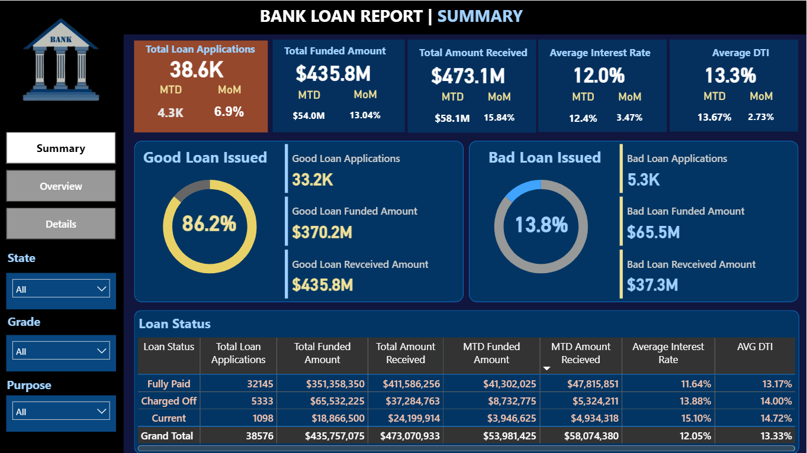
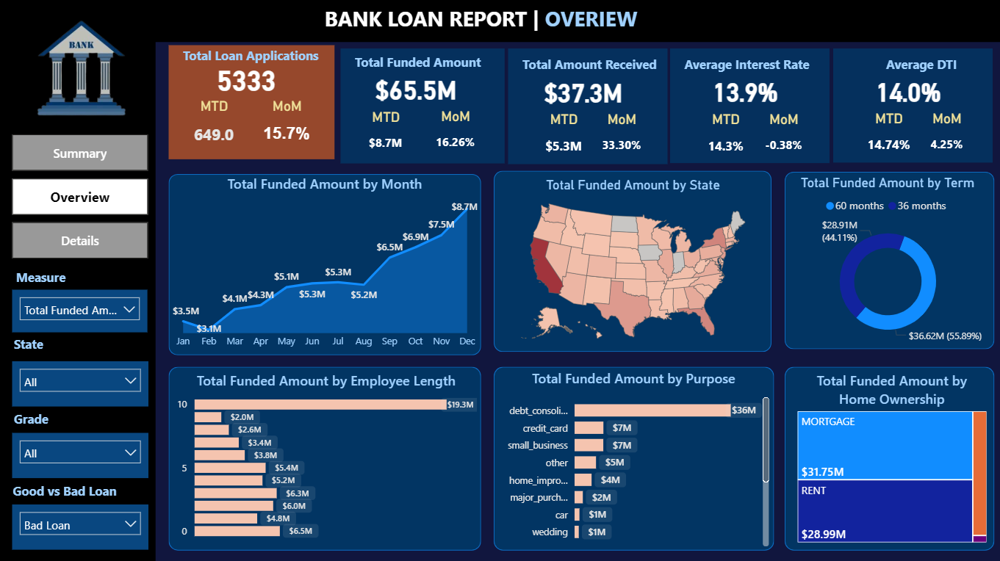
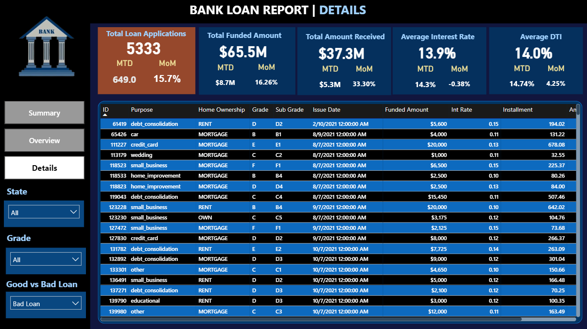

# Bank Loan Analysis Report


## Overview

This project provides a comprehensive analysis of loan data for a financial institution. The primary objective is to identify key borrower demographics, understand loan purposes, and assess the risk of default. By analyzing historical loan data, this project aims to support data-driven lending decisions, minimize charge-offs, and optimize overall portfolio health.

## Key Findings

- **Volume:** Processed 38,576 loan applications, representing $435.8M in total funded amount.
- **Performance:** 86.2% of loans are classified as Good Loans (Fully Paid or Current), while 13.8% resulted in charge-offs.
- **Financial Metrics:** The portfolio has an overall average interest rate of 12.05% and an average debt-to-income (DTI) ratio of 13.33%.
- **Primary Driver:** Debt consolidation is the leading purpose for borrowing, accounting for 18,214 applications and $232M in funding.

## Project Structure

```text
bank-loan-analysis/
├── data_cleaning.py                  # Data cleaning and preprocessing
├── bank_loan_queries.sql             # SQL analysis queries 
├── bank_loan_dashboard.pbix          # Interactive Power BI dashboard
├── Project_Report.pdf                # Detailed written report
├── images/                           # Dashboard screenshots
│   ├── img1.png                      
│   ├── img2.png                      
│   └── img3.png                      
└── bank_loan_data.csv                # Raw dataset (38,576 records)
```

## Dataset Overview

The dataset contains 38,576 records across 24 features, broadly categorized into:

- **Loan Information:** Amount, Interest Rate, Installment, Term, Purpose, Grade
- **Borrower Details:** Annual Income, Employment Length, Home Ownership, State
- **Loan Performance:** Status (Fully Paid, Current, Charged Off)
- **Payment Data:** Total Payment Received, Payment Dates

## Methodology

### 1. Data Preparation (Python)
- Imported and structured the dataset using Pandas.
- Standardized date fields to a consistent format.
- Addressed missing values (e.g., imputing employment titles) and removed formatting inconsistencies.
- Exported the refined dataset to MySQL for downstream analysis.

### 2. Business Analysis (MySQL)
Developed SQL queries to extract business KPIs:
- Aggregated total applications, funded amounts, and received payments, including month-to-date (MTD) trends.
- Calculated portfolio averages (Interest Rate, DTI).
- Segmented data to differentiate Good vs. Bad loan performance.
- Analyzed trends across demographics, loan terms, and states.

### 3. Data Visualization (Power BI)
Built an interactive dashboard featuring three core views:
- **Summary:** High-level KPIs, Good vs. Bad loan breakdown, and MTD metrics.
- **Overview:** Funding trends, geographic distribution, and demographic breakdowns.
- **Details:** Granular, loan-level data for deep dives.

### Dashboard Previews

**Summary View**


**Overview View**


**Details View**


## Business Recommendations

1. **Tighten High-DTI Approvals:** Loans that eventually charge off average a 14% DTI, compared to 13.17% for fully paid loans. Consider stricter approval thresholds for high-DTI applicants.
2. **Monitor Early Warning Signals:** Implement automated alerts for accounts showing repayment delays to improve recovery efforts before they reach charge-off status.
3. **Focus on Low-Risk Segments:** Prioritize borrowers with stable employment (10+ years), lower DTI, and mortgage ownership, as these groups demonstrate the most reliable repayment behavior.
4. **Optimize Risk-Based Pricing:** Current loans carry the highest average interest (15.10%). Dynamic, risk-based pricing can improve portfolio yield without necessarily increasing default rates.
5. **Retain Repeat Borrowers:** Borrowers utilizing 36-month terms represent a significant segment ($273M funded). Offer targeted refinancing or loyalty products to retain them.
6. **Diversify the Portfolio:** With debt consolidation driving 47% of applications, there is an opportunity to reduce concentration risk by promoting other loan categories like small business or home improvement.

## Author

**Ranjeet Gupta**  
Data Analyst | Python · SQL · Power BI
